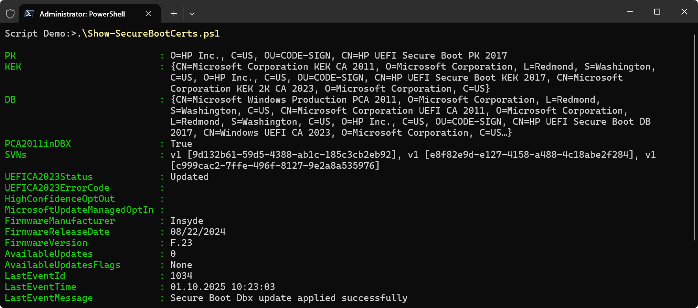

# Secure Boot Certificates Script

This PowerShell script retrieves and displays information about Secure Boot certificates and related data on a Windows system. It is meant to simplify the process of checking Secure Boot status and certificate details.

## Features

- Retrieves Secure Boot certificate information (PK, KEK, DB, DBX).
- Displays boot manager (bootmgfw.efi) signature and certificate chain from EFI partition.
- Reads Security Version Number (SVN) information from DBX.
- Checks if PCA 2011 certificate is revoked (present in DBX).
- Shows Secure Boot servicing status and available updates with detailed flags.
- Displays UEFI CA 2023 update status, errors, and error codes.
- Retrieves recent TPM-WMI event log entries related to Secure Boot updates.
- Provides firmware details including manufacturer, release date, version, and next update availability.

## Usage

To run the script, in an elevated PowerShell session, execute the following command:

```powershell
.\Show-SecureBootCerts.ps1
```

## Requirements

- PowerShell 7 or later

## Demo



## Contributing

Contributions are welcome! Please fork the repository and submit a pull request with your changes. Or simply open an issue to discuss what you would like to change
